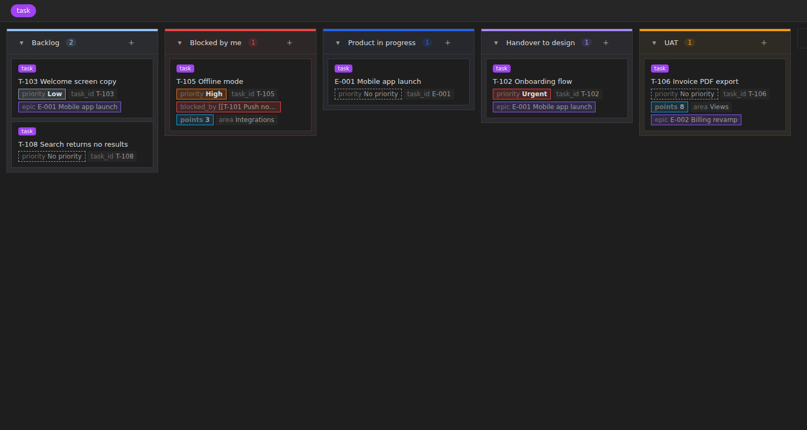
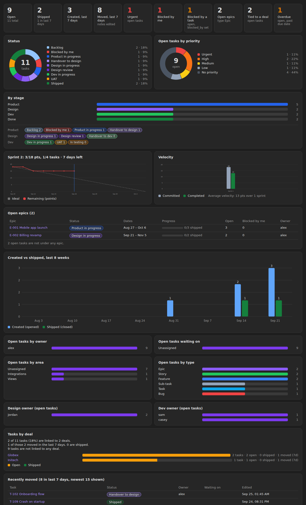
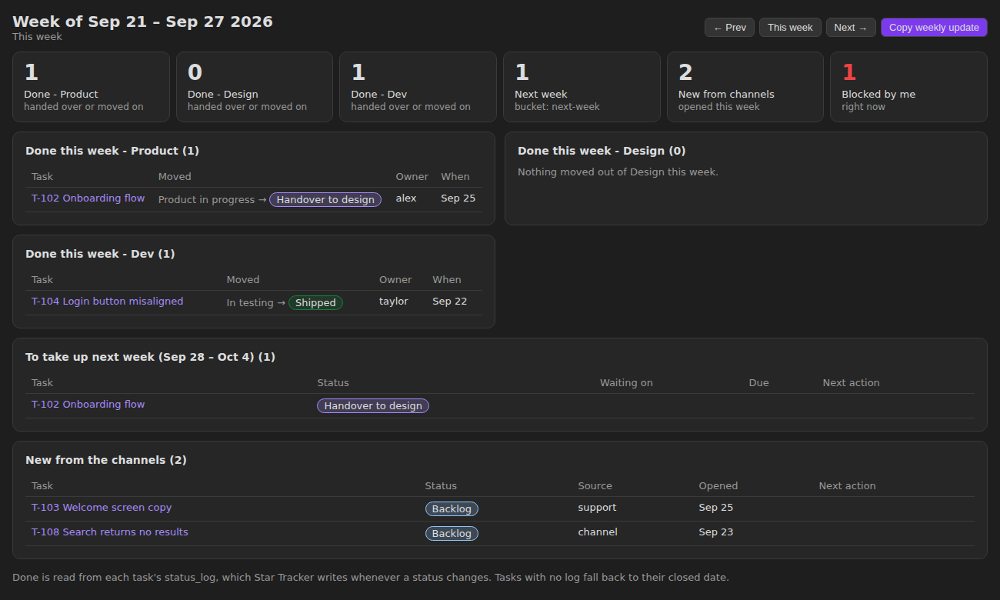
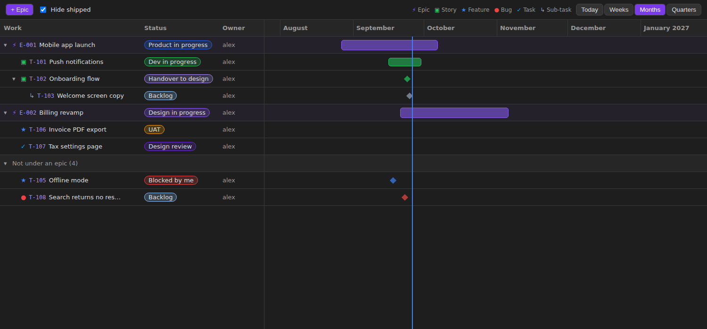
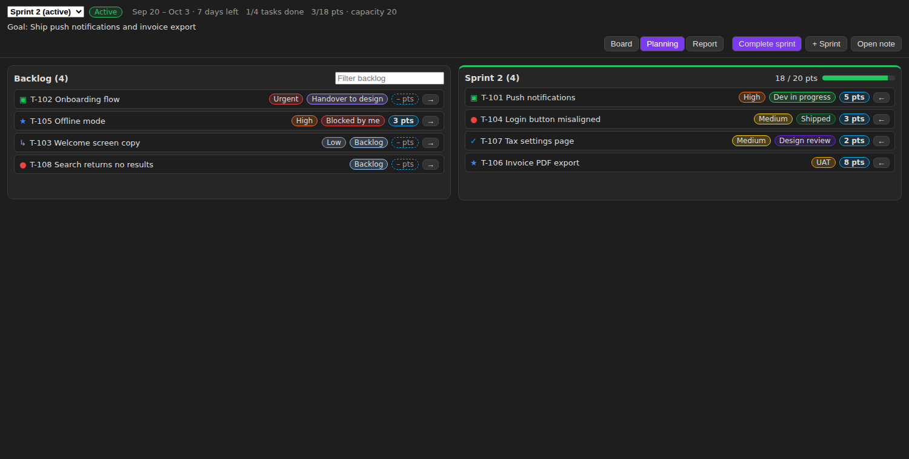
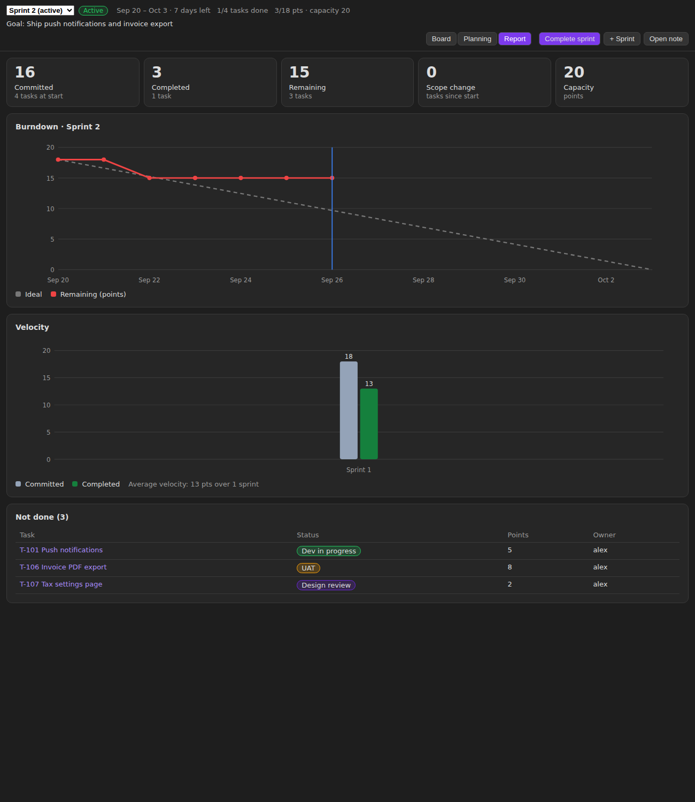

# Star Tracker

A Jira-style tracker built on Obsidian Bases. Your tasks stay plain Markdown notes. Star Tracker adds four views to any base:

| View | What it shows |
|---|---|
| **Star board** | Kanban board. Drag cards between columns to change a status, priority or any other property. |
| **Star dashboard** | Tiles and charts: status, priority, stages, open epics, owners, related records, created vs done, recently moved. |
| **Star weekly** | What each stage finished this week, what is planned for next week, what came in from outside. One click copies the update as text. |
| **Star timeline** | Epics, stories and sub-tasks on a timeline, with a + button to add items under an epic. |
| **Star sprint** | Sprint board, sprint planning (backlog ↔ sprint), and a report with burndown and velocity. Start and complete sprints. |



## Quick start

1. Install and enable Star Tracker.
2. Open **Settings → Star Tracker** and check the defaults: task tag (`task` by default), statuses, stages, priorities, types.
3. Run the command **Star Tracker: Create a tracker**. Pick a folder. You get a base with a dashboard, a global board, one board per stage, a priority board, a sprint view, a weekly view, a timeline and a table of blocked tasks, plus a first sprint note.
4. Already have task notes? Run **Star Tracker: Add missing fields to task notes** to add empty `type`, `status`, `priority`, `parent`, `start`, `end`, `blocked_by`, `points`, `sprint` and owner fields where they are missing.

You can also add any Star Tracker view to an existing base from the Bases view picker.

## Several trackers

- Run **Create a tracker** as many times as you like. Each tracker gets its own folder, base and task tag (for example `work` and `home`), so their tasks stay apart. The tag is added to **Task tags** in settings.
- The **tracker icon** in the left ribbon (or the command **Open a tracker**) opens your tracker in one click. With more than one, it shows a list of all of them: press Enter to open, Mod+Enter for a new tab, Shift+Enter to open to the right, so you can keep two or three boards side by side.
- Any base with a Star Tracker view shows up in the list, including ones you built by hand.

## How tasks are stored

A task is a note with the task tag (default `#task`). Everything lives in frontmatter:

```yaml
---
tags: [task]
type: Story
status: Dev in progress
priority: High
parent: "[[E-001 Mobile app launch]]"
start: 2026-09-01
end: 2026-09-20
blocked_by: ["[[T-101 Push notifications]]"]
owner: alex
design_owner: jordan
dev_owner: sam
deals: ["[[Globex]]"]
sprint: "[[Sprint 4]]"
points: 5
status_log:
  - 2026-09-12 | Handover to dev → Dev in progress
---
```

Every field name can be changed in settings.

## Board

The Star board is a fork of [Base Board](https://github.com/mderazon/obsidian-base-board) by Michael DeRazon (MIT), with Star Tracker's card chips added. Everything Base Board does works here:

- Columns come from the view's **Group by** property. Drag cards between columns and reorder them inside a column (order is stored in `kanban_order`).
- Drag columns to reorder, rename, add or delete them, set a color or a WIP limit from the column menu, collapse a column.
- Add cards inline from a column's **+**, select several cards and move them together.
- Filter by tag, show a cover image, open cards in a tab, split or floating modal.

What cards show:

- By default, the fields in **Settings → Star Tracker → Board cards → Card fields** (`priority, points, blocked_by, owner, due`).
- If you pick properties in a board's own **Properties** menu, that board uses those instead.
- Turn on **Use card fields on every board** to make every board use the settings list.
- Toggles for the extra chips: always show priority, show epic, show blocks count.

Star Tracker adds:

- Column colors from settings when a column has no color of its own (status, priority, type), and column order from settings when the base has none stored.
- A priority chip on every card, colored by level (dashed when empty).
- `blocked_by` in red while any blocker is open, green once all are done.
- "blocks N": how many open tasks are waiting on this one.
- The epic the task belongs to (walks up `parent` links), points and sprint chips.

Moving from Base Board: change `type: kanban` to `type: star-board` in the `.base` file. `groupBy`, `boardColumns`, `columnColors`, `collapsedColumns`, `wipLimits` and `kanban_order` carry over. Turn Base Board off afterwards so the two plugins don't both style the same cards.

## Dashboard



- Tiles: open, done, created and moved in the last 7 days, top priority, needs-attention status, blocked by a task, open epics, tied to a related record, overdue.
- Status and priority donuts, a by-stage chart with a per-status breakdown.
- Open epics with dates, a progress bar and open child counts.
- Created vs done for the last 8 weeks.
- Open tasks by owner, waiting on, area, type and each role owner field.
- Tasks by related record (for example deals): how many, how many open, done and moved.

## Weekly view



- **Done this week, per stage.** A task counts for a stage when its status moved out of that stage, or into a status marked as a handover (for example *Handover to design*).
- **To take up next week.** Tasks whose `bucket` is `next-week`.
- **New from the channels.** Tasks opened this week with `bucket: channel`, or whose `source` is not in your list of internal sources.
- **Copy weekly update** puts the whole summary on the clipboard, ready to paste into chat.

The weekly view reads `status_log`. Star Tracker writes a dated line there each time a task's status changes (you can turn this off). It also sets `closed` when a task reaches the done status.

## Timeline



- Three levels by default: Epic → Story / Feature / Bug / Task → Sub-task, linked with `parent`.
- Bars use `start` and `end`. An epic with no dates spans its children (dashed bar) and shows progress.
- Tasks with no dates show as a diamond on their opened date.
- Zoom by weeks, months or quarters. Hide done items.
- **+ Epic** adds an epic. The **+** on a row adds a child of the type set in settings.

## Sprints



A sprint is a note tagged `#sprint` (in the `Sprints` folder by default):

```yaml
---
tags: [sprint]
state: active        # planned, active or closed
start: 2026-09-20
end: 2026-10-03
goal: Ship push notifications
capacity: 20         # points
---
```

Tasks join a sprint through their `sprint` field. The **Star sprint** view has three tabs:

- **Board**: the chosen sprint's tasks as a kanban board. Drag to change status, **+ New** adds a task straight into the sprint. Empty columns are hidden.
- **Planning**: backlog on the left, sprint on the right. Drag tasks across or use the arrow buttons. Click the points chip to estimate. The sprint side shows points against capacity and turns red when over.
- **Report**: committed, completed, remaining, scope change and capacity, a burndown chart (ideal vs remaining, by day) and velocity for the last 6 closed sprints.



Header buttons:

- **Start sprint** sets the sprint to active, fills in dates if missing and records what was committed. Only one sprint can be active.
- **Complete sprint** records completed points and tasks, then moves unfinished tasks to the next planned sprint, a new sprint, or the backlog.
- **+ Sprint** (or the command **Create the next sprint**) makes the next sprint note, starting the day after the last one ends.

The burndown uses the date each task reached the done status from `status_log`. When no task in the sprint has points, charts count tasks instead. The dashboard shows the active sprint's burndown and velocity too. Right-click any board card to set its sprint or points.

## Settings

Everything has a default and can be changed:

- Task tags (one or more, comma separated), tracker ribbon icon, done status, needs-attention status, status for new tasks, default owner, week start day.
- **Stages** (name, color) and **statuses** (name, color, stage, handover), in board order.
- **Priorities** (name, color), highest first.
- **Task types** (name, icon, color, child type). The first type is the top level.
- **Role owners**: extra owner fields such as design owner and dev owner.
- Board cards: card fields, use them on every board, and toggles for priority, epic and blocks chips.
- Sprints: tag, folder, length in days, default capacity, point scale.
- Weekly view buckets and internal sources.
- Label for the related record field (Deal, Customer, Project).
- Every frontmatter field name.

Renaming a status in settings does not rename it in your notes.

## Install by hand

Download `main.js`, `manifest.json` and `styles.css` from the latest release into `<vault>/.obsidian/plugins/star-tracker/`, then enable the plugin.

## Build

```bash
npm install
npm run build
```

## License

MIT. The board code is forked from Base Board, MIT, Copyright (c) 2026 Michael DeRazon. See `LICENSE-BASE-BOARD`.
